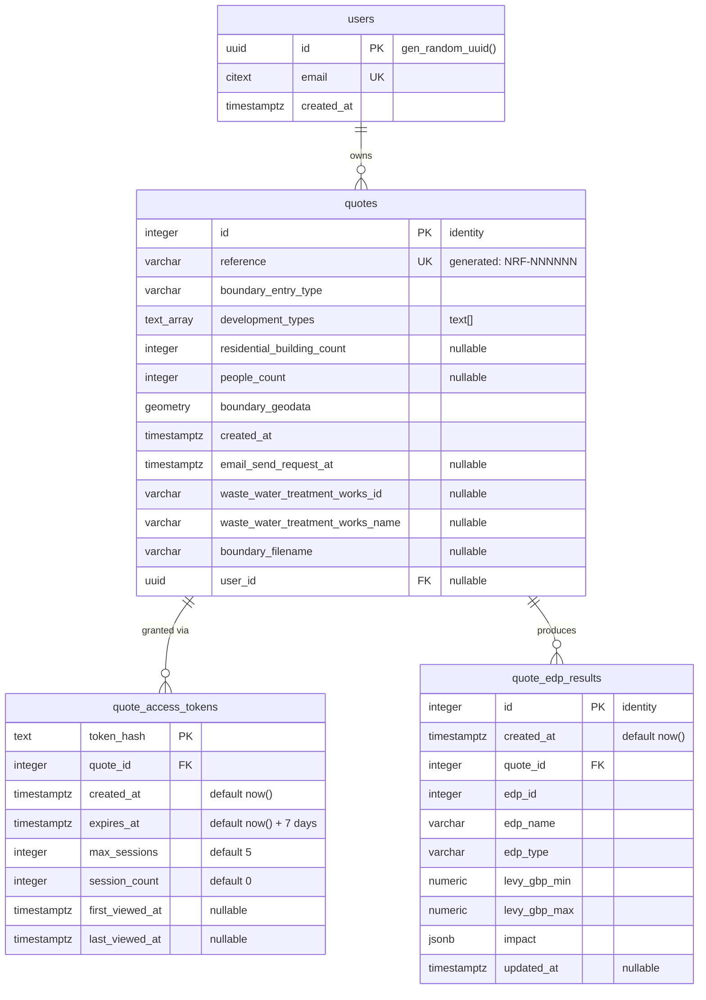

# Quote database ERD

Entity-relationship diagram of the backend **`nrf_backend`** Postgres database
(schema `public`) — the quote domain.

- **Source:** live `nrf_backend` Postgres instance (`docker compose` service `postgres`), cross-checked against the Liquibase changelog under `backend/changelog/`.
- **Generated:** 2026-06-19
- **Scope:** application domain tables only. Liquibase bookkeeping (`databasechangelog`, `databasechangeloglock`) and the PostGIS reference table (`spatial_ref_sys`) are excluded.

## Tables

| Table                 | Purpose                                                                                                                   |
| --------------------- | ------------------------------------------------------------------------------------------------------------------------- |
| `users`               | Account holders, keyed by UUID and unique (case-insensitive) email.                                                       |
| `quotes`              | Core quote records: development boundary, type, counts, and the spatial boundary geometry. Optionally linked to a `user`. |
| `quote_access_tokens` | Hashed access tokens granting time-limited, session-capped access to a quote.                                             |
| `quote_edp_results`   | Per-EDP levy results computed for a quote (unique per `quote_id` + `edp_id`).                                             |

## Notes

- `quotes.reference` is a generated column (`NRF-` + a hashed, zero-padded id) defined via raw SQL in the Liquibase changelog.
- `quote_access_tokens` and `quote_edp_results` foreign keys to `quotes` are `ON DELETE CASCADE`.
- `quotes.user_id` is nullable — a quote can exist without an associated user.
- This is the backend quote database, not the impact-assessor DB (`nrf_impact`, schema `nrf_reference`).
