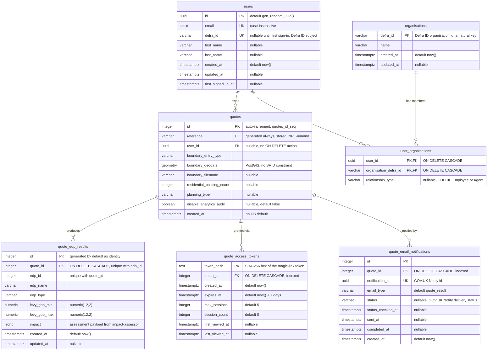

# Quote database ERD

Entity-relationship diagram of the backend **`nrf_backend`** Postgres database —
the quote domain: accounts, the organisations they act for, quotes, the levy
results produced for them, and the tokens and emails that deliver them.

- **Source:** live `nrf_backend` Postgres (`docker compose` service `postgres`),
  schema `public`, cross-checked against the Liquibase changelog under
  `backend/changelog/`.
- **Generated:** 2026-08-13, by the `generate-db-diagram` skill.
- **Scope:** application domain tables only. Liquibase bookkeeping
  (`databasechangelog`, `databasechangeloglock`) and PostGIS internals
  (`spatial_ref_sys`, and the `tiger` / `topology` extension schemas) are excluded.

## Tables

| Table                       | Purpose                                                                                                                  |
| --------------------------- | ------------------------------------------------------------------------------------------------------------------------ |
| `users`                     | One row per signed-in account, keyed on the Defra ID subject.                                                            |
| `organisations`             | Organisations from Defra ID that users can act on behalf of.                                                             |
| `user_organisations`        | Which users act for which organisations, and in what capacity (`Employee` or `Agent`). Composite PK; both sides cascade. |
| `quotes`                    | One row per levy estimate requested through the public journey.                                                          |
| `quote_edp_results`         | One row per Environmental Delivery Plan a quote's boundary intersects, with the levy range assessed for it.              |
| `quote_access_tokens`       | Magic-link tokens granting access to a quote without a login. Only the hash is stored.                                   |
| `quote_email_notifications` | Outbound quote emails and their GOV.UK Notify delivery status.                                                           |

## Constraints and indexes worth knowing

| Name                             | Rule                                                                                                                                                                                                                                                              |
| -------------------------------- | ----------------------------------------------------------------------------------------------------------------------------------------------------------------------------------------------------------------------------------------------------------------- |
| `quotes_reference_key`           | `reference` is `UNIQUE` and **generated always**: `'NRL-' \|\| lpad((id * 2654435761) % 1000000, 6, '0')`. The multiplier is coprime with 1000000, so id → reference is a bijection. Changeset `2.9` changed the prefix from `NRF-`; the id mapping is unchanged. |
| `uq_quote_edp_results_quote_edp` | `UNIQUE (quote_id, edp_id)` — a duplicate estimate callback once inserted a second set of rows for one quote, letting two access tokens be issued. The constraint makes the duplicate conflict instead of succeeding.                                             |
| `uq_qen_notification_id`         | `UNIQUE (notification_id)` — one row per Notify message, so status polling cannot double-count.                                                                                                                                                                   |
| `idx_qen_pending`                | Partial index over `created_at` where `status` is null or not a terminal state — the working set for the delivery-status poller.                                                                                                                                  |
| `uq_users_defra_id`              | `UNIQUE (defra_id)` — one account per Defra ID subject.                                                                                                                                                                                                           |
| `idx_qat_quote`                  | `quote_access_tokens (quote_id)`.                                                                                                                                                                                                                                 |

| `ck_uo_relationship_type` | `CHECK (relationship_type IN ('Employee','Agent'))` on `user_organisations`. A NULL passes the check, so the column is genuinely optional. |

Deleting a quote cascades to its EDP results, access tokens and email
notifications. Deleting a user does **not** cascade to their quotes — `user_id`
is nullable and the FK takes no action, so a quote outlives the account.

A few behaviours the column list does not convey:

- `users.defra_id` is unique but nullable — an account created before its first
  sign-in has no Defra ID yet, and Postgres allows multiple NULLs under a unique
  constraint.
- `quote_email_notifications.status` is null until the Notify status poller first
  fetches it. A quote accumulates several rows over its lifetime — the initial
  quote-result send plus any resends, told apart by `email_type`.
