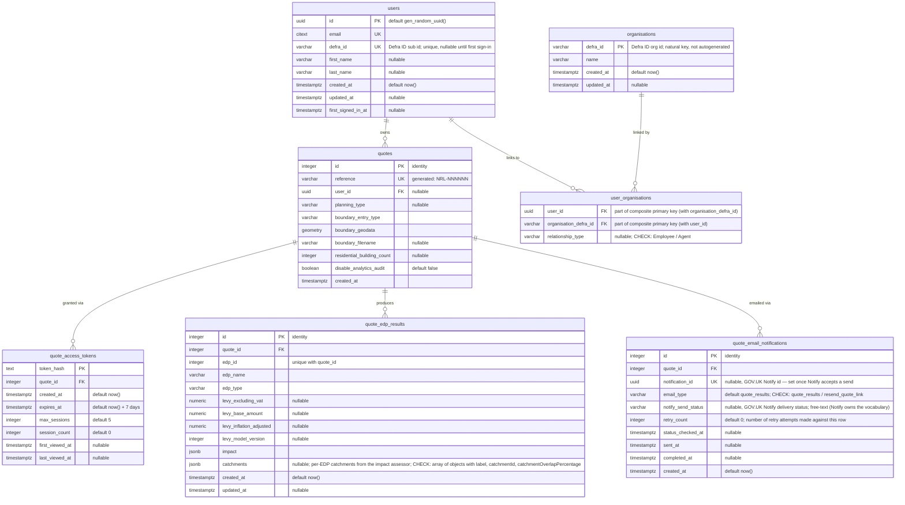

# Quote database ERD

Entity-relationship diagram of the backend **`nrf_backend`** Postgres database
(schema `public`) — the quote domain.

- **Source:** live `nrf_backend` Postgres instance (`docker compose` service `postgres`), cross-checked against the Liquibase changelog under `backend/changelog/`.
- **Generated:** 2026-09-08

- **Scope:** application domain tables only. Liquibase bookkeeping (`databasechangelog`, `databasechangeloglock`) and the PostGIS reference table (`spatial_ref_sys`) are excluded.

## Tables

| Table                       | Purpose                                                                                                                                                                                                                                                                                                                         |
| --------------------------- | ------------------------------------------------------------------------------------------------------------------------------------------------------------------------------------------------------------------------------------------------------------------------------------------------------------------------------- |
| `users`                     | Account holders, keyed by UUID and unique (case-insensitive) email; Defra ID profile details captured at sign-in.                                                                                                                                                                                                               |
| `organisations`             | Organisations as identified by Defra ID, keyed by the (natural) `defra_id`.                                                                                                                                                                                                                                                     |
| `user_organisations`        | Join table linking users to organisations with a relationship type (employee / agent). Citizens have no organisation link.                                                                                                                                                                                                      |
| `quotes`                    | Core quote records: development boundary, type, counts, and the spatial boundary geometry. Optionally linked to a `user`.                                                                                                                                                                                                       |
| `quote_access_tokens`       | Hashed access tokens granting time-limited, session-capped access to a quote.                                                                                                                                                                                                                                                   |
| `quote_edp_results`         | Per-EDP levy results computed for a quote (unique per `quote_id` + `edp_id`).                                                                                                                                                                                                                                                   |
| `quote_email_notifications` | One row per quote email lifecycle, keyed by `email_type`: `quote_results` (impact assessor delivers levy results) or `resend_quote_link` (applicant requests a new access link). Holds the current Notify id and polled delivery status; retries update the row in place and bump `retry_count` rather than inserting new rows. |

## Notes

- `quotes.reference` is a generated column (`NRL-` + a hashed, zero-padded id) defined via raw SQL in the Liquibase changelog.
- `quote_access_tokens`, `quote_edp_results` and `quote_email_notifications` foreign keys to `quotes` are `ON DELETE CASCADE`.
- `user_organisations` rows cascade-delete when their parent `users.id` or `organisations.defra_id` row is deleted.
- `user_organisations.user_id + organisation_defra_id` form the composite primary key — one row per user/organisation pair. `relationship_type` is nullable and restricted by a CHECK constraint to Employee / Agent (NULL passes the check) — a Citizen never gets a row here.
- `users.defra_id` is unique but nullable — users created before signing in have no Defra ID yet (Postgres allows multiple NULLs under a unique constraint).
- `quotes.user_id` is nullable — a quote can exist without an associated user.
- A quote has zero `quote_email_notifications` rows before its first send, one after the initial `quote_results`, and one more per user-initiated resend. Retries do **not** create new rows — they update the existing row in place. So the one-to-many is bounded in practice by "1 + number of resends," not "1 + number of send attempts."
- `quote_email_notifications.email_type` is constrained by a CHECK to `quote_results` (impact assessor delivered results) and `resend_quote_link` (applicant requested a new access link). Each such row represents one email lifecycle — the retry worker updates the row in place, overwriting `notification_id` with the fresh id Notify returns and resetting `notify_send_status` / `sent_at` / `completed_at` so the poller repopulates them; `retry_count` is bumped on every attempt, including ones Notify rejects at accept time (those leave `notification_id` unchanged).
- `quote_email_notifications.notification_id` is nullable and unique: it stays null until Notify accepts a send, then holds the current Notify id for the lifecycle. The poller skips rows where it is still null (a retry Notify rejected at accept time on a fresh lifecycle).
- `quote_email_notifications.notify_send_status` is deliberately free-text: it mirrors a GOV.UK Notify delivery status, whose vocabulary Notify owns, so pinning it to a CHECK would break us the day Notify adds a new value. It is null until the Notify status poller first fetches it. See [GOV.UK Notify email status descriptions](https://docs.notifications.service.gov.uk/node.html#email-status-descriptions) for the values Notify currently returns.
- `quote_edp_results` levy columns (`levy_excluding_vat`, `levy_base_amount`, `levy_inflation_adjusted`) are `NUMERIC(12,2)`; `levy_model_version` is `INTEGER`. All four are nullable — they are populated when the impact assessor reports results.
- `quote_edp_results.catchments` is a jsonb array of `{ label: string, catchmentId: string | null, catchmentOverlapPercentage: number 0-100 }`, recorded as-is from the impact assessor callback. The `ck_quote_edp_results_catchments` CHECK constraint enforces that shape (NULL passes — the column is optional while the assessor rolls out) but permits extra keys, so the assessor can add fields without a migration.
- This is the backend quote database, not the impact-assessor DB (`nrf_impact`, schema `public`).
